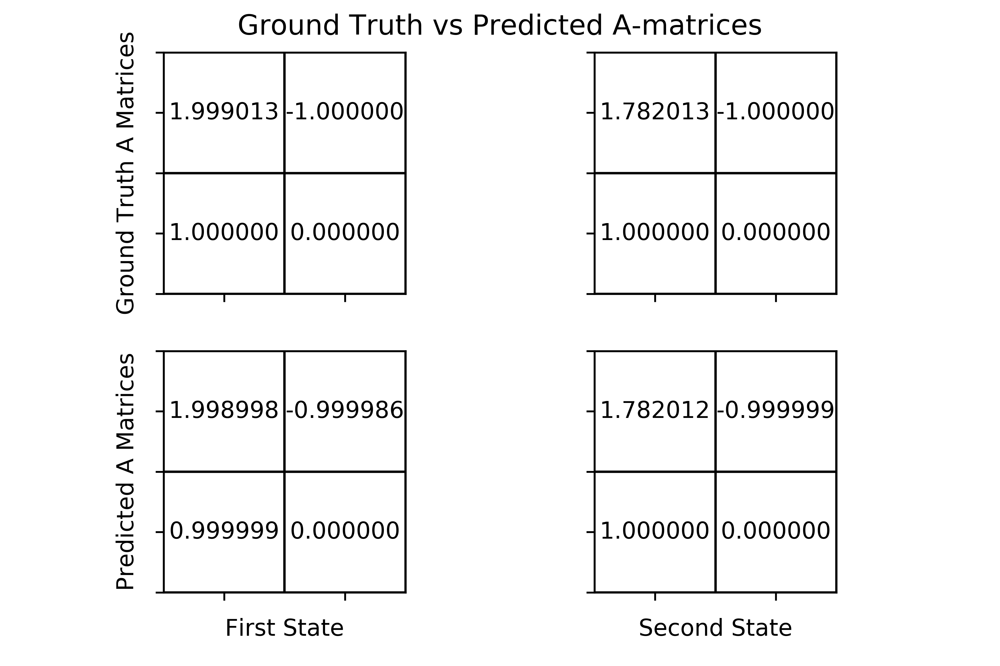

# sticky-HDP-HMM-Vector Autoregression
A python implementation of the sticky-HDP-HMM-VAR model[1].  
For a fast implementation of stable HMM algorithms[2] some functions were implemented in C++.

## The algorithm in a nutshell
The sticky-HDP-HMM-VAR is an unsupervised machine learning algorithm used to model dynamical phenomena by switching between linear dynamical systems (SLDS). 
Each different linear dynamical system is called an SLDS mode.  
Vector Autoregression is a special SLDS case in which each observation is modeled as a linear function of the previous observations.   
The switching between SLDS modes is governed via a Hidden Markov Model (HMM) such that each SLDS mode corresponds to an HMM state.   
A Hierarchical Dirichlet Process (HDP) is used as a prior for the HMM parameters. This implementation uses the L-weak limit approximation to the DP[3] such that one needs to pre-specify the maximum number of states, L, as long as L exceeds the total number of expected HMM states. 
The sticky part introduces a bias for the self-transition probability of a state.  

The VAR equation is given by:  
  
where z(t) is the HMM-state/SLDS-mode at time t and r is the VAR order.

### Setup
As part of the code is run in c++ one needs to compile the c++ part.  
Please run the following commands from within the `utils/math` directory:
> g++ -std=c++11 -Wall -Wextra -pedantic -c -fPIC c_extensions.cpp -o c_extensions.o  
> g++ -shared c_extensions.o -o c_extensions.dylib

*Note - the code was tested and compiled with `g++` but will probably work with any other compiler*

## Running the model
All of the methods needed to run the model are part of a class in `model/sticky_hdp_hmm_var.py`.
A class instance is initialized with uninformative priors and default training parameters.
These priors and parameters may be changed, see `parameters.py` for a description. 

To train a model one needs to prepare the data in the right format. This should be done with the `generate_data_structure` method in `utils/data_preparation.py`.  
Once the data is in the right format the method `train` of the model instance trains the model.
A trained model can predict a state-sequence to best fit a given data using the `predict_state_sequence` method of the model's instance.
The method `predict_observations` can be used to generate observations from a given starting point.

### Notebook Example
As the model is unsupervised the notebook's idea is to overfit it on a known example to see if one can 'trust' the model.
As a sanity check one can construct observations from a state-space representation of different sine-waves
in the notebook `sine_wave.ipynb` and train the model on it.
The notebook currently contains an example of observations generated via 2 sine-waves that inter-switch 3 times.
Comparing the A-matrices of the sine-waves (ground truth) and the A-matrices of the model trained on these waves 
results in nearly identical values

Generating observations using the A-matrices of the trained model vs the ground truth makes it very difficult to observe any differences 

## References
[1] Emily Fox, Erik B. Sudderth, Michael I. Jordan, and Alan S. Willsky. Nonparametric
bayesian learning of switching linear dynamical systems. In D. Koller, D. Schuurmans,
Y. Bengio, and L. Bottou, editors, Advances in Neural Information Processing Systems 21,
pages 457–464. Curran Associates, Inc., 2009.  
https://arxiv.org/abs/1003.3829  
[2] Tobias P. Mann.  Numerically stable hidden markov model implementation.Ms. Feb,2006  
http://citeseerx.ist.psu.edu/viewdoc/summary?doi=10.1.1.322.9645  
[3] Ishwaran, Hemant; Zarepour, Mahmoud Exact and approximate sum representations for the Dirichlet process. Canad. J. Statist. 30 (2002), no. 2, 269–283.   
https://onlinelibrary.wiley.com/doi/abs/10.2307/3315951  